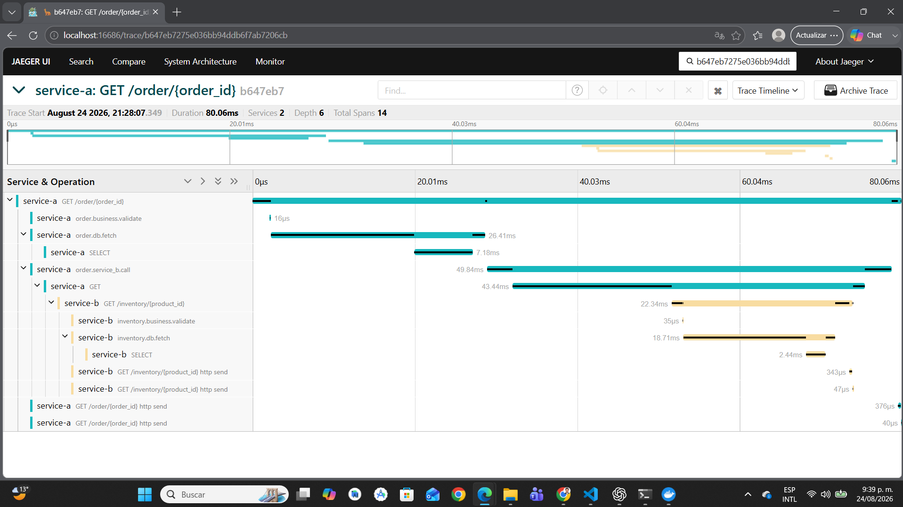
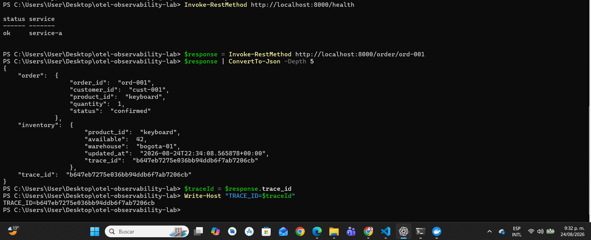
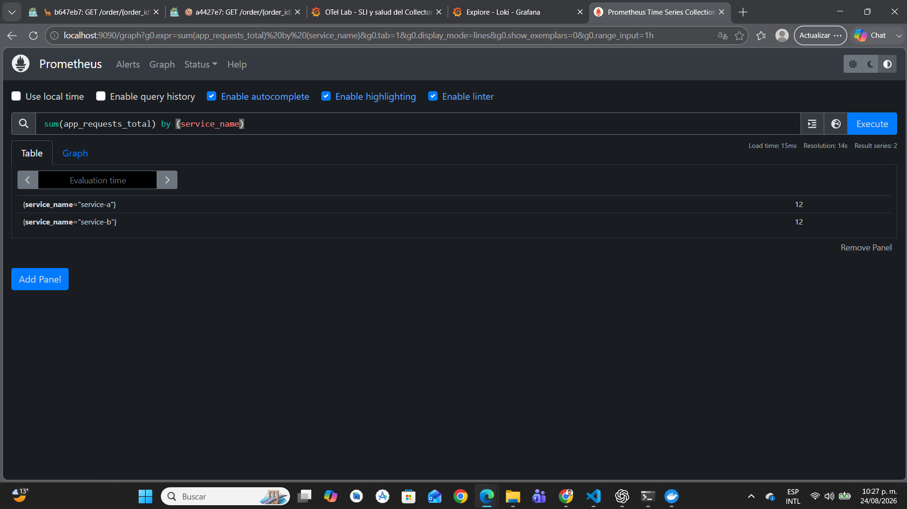
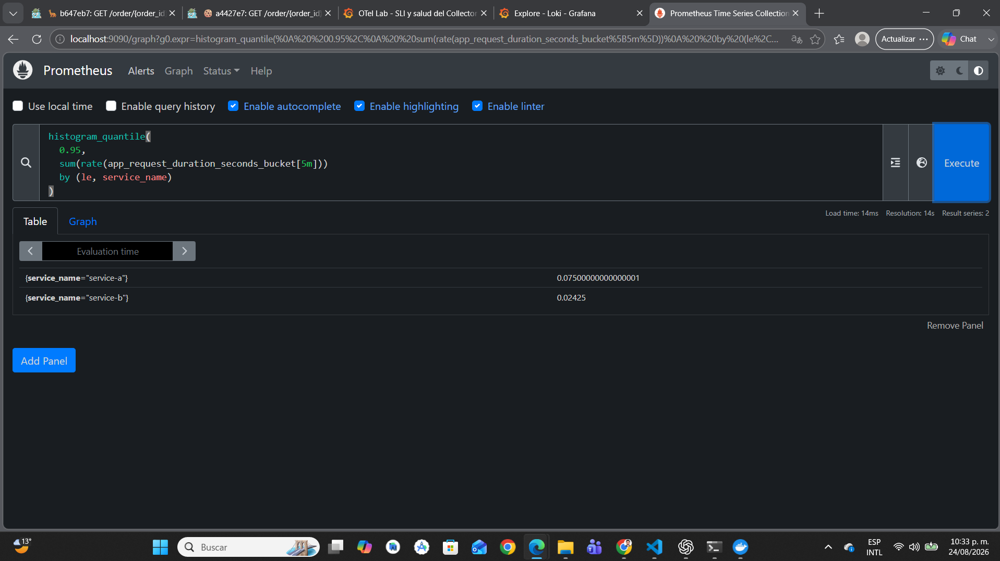
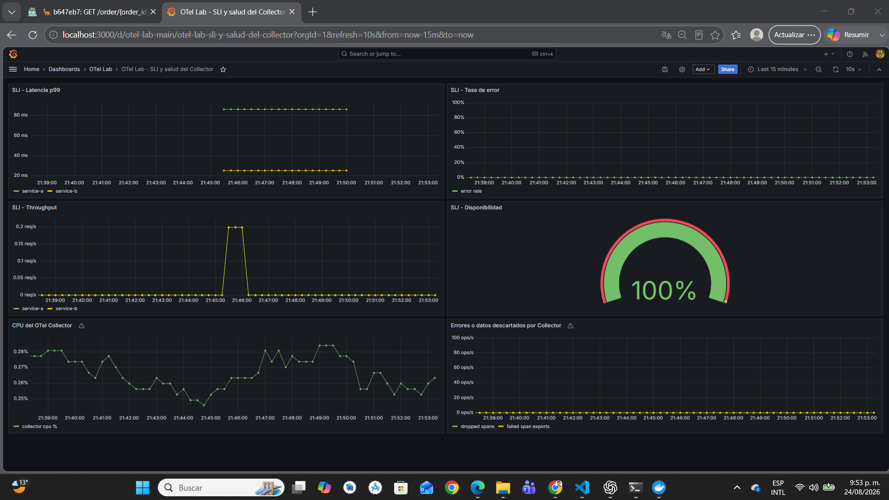
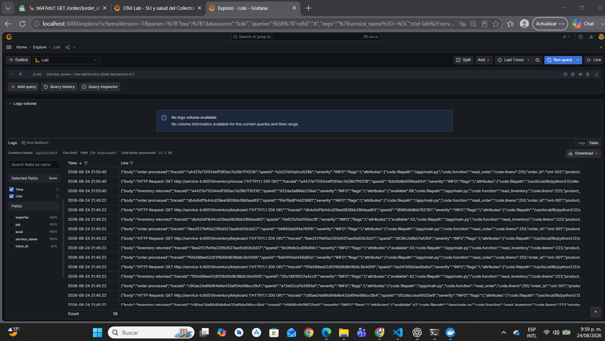
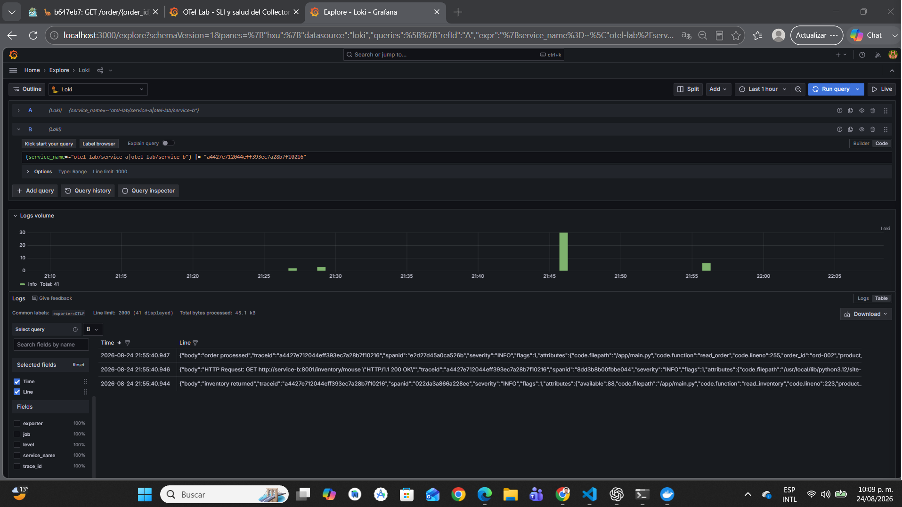

# Pipeline de observabilidad end-to-end con OpenTelemetry

Proyecto académico propio para implementar y demostrar un pipeline de observabilidad basado en OpenTelemetry para una arquitectura de microservicios.

**Integrante:** Jose Luis Mora

La solución contiene dos microservicios, service-a y service-b, que se comunican por HTTP, consultan PostgreSQL y emiten las tres señales principales de observabilidad:

- Trazas distribuidas: OpenTelemetry SDK → OTel Collector → Jaeger.
- Métricas: OpenTelemetry SDK → OTel Collector → Prometheus → Grafana.
- Logs estructurados: aplicación → JSON/stdout y OTLP → OTel Collector → Loki → Grafana.

El laboratorio fue ejecutado y validado localmente con Docker Desktop. No se realizaron despliegues en GCP ni AWS porque no se contaba con cuentas disponibles para la actividad. Además, de acuerdo con la indicación recibida en clase, las mediciones y evidencias se realizaron en local. Por lo tanto, este repositorio distingue explícitamente entre componentes ejecutados localmente, infraestructura cloud documentada mediante Terraform pero no aplicada y resultados del benchmark obtenidos en el equipo local.

El documento técnico principal de la entrega es [report/technical-report.pdf](report/technical-report.pdf). Este README funciona como índice ampliado y guía de reproducción: explica el contexto, enlaza cada evidencia y permite repetir localmente los pasos descritos en el PDF.

## 1. Objetivos de la actividad

El objetivo fue construir un flujo de observabilidad que permitiera:

- seguir una solicitud desde service-a hasta service-b y PostgreSQL;
- propagar el contexto W3C Trace Context entre servicios;
- generar trazas, métricas y logs con el SDK de OpenTelemetry;
- centralizar las señales mediante un OTel Collector;
- consultar métricas en Prometheus y visualizarlas en Grafana;
- buscar logs estructurados en Loki;
- usar trace_id como pivote entre logs y trazas;
- observar el impacto de habilitar OTel mediante un benchmark comparativo;
- documentar una arquitectura trasladable posteriormente a GKE y ECS Fargate.

## 2. Alcance y decisión de ejecución local

### Lo que sí se ejecutó

El siguiente flujo fue levantado, probado y evidenciado en local:

    k6 / cliente HTTP
            |
            v
    service-a:8000
            | HTTP + W3C Trace Context
            v
    service-b:8001
            |
            v
    PostgreSQL:5432

    service-a y service-b
            |
            | OTLP/gRPC
            v
    OTel Collector
       |          |          |
       v          v          v
     Jaeger   Prometheus    Loki
       \          |          /
        \         v         /
             Grafana

### Lo que no se ejecutó

No se aplicaron recursos en:

- Google Cloud Platform / GKE;
- Amazon Web Services / ECS Fargate.

Las carpetas infra/gcp e infra/aws contienen Terraform de referencia y decisiones de despliegue. No deben interpretarse como evidencia de recursos cloud activos. Aplicar Terraform requeriría cuentas, permisos, presupuesto, redes, secretos y controles de costo que no estaban disponibles para esta entrega.

## 3. Arquitectura implementada

### Componentes de aplicación

| Componente | Función | Puerto local |
|---|---|---:|
| service-a | Recibe pedidos, consulta PostgreSQL y llama a service-b | 8000 |
| service-b | Consulta inventario en PostgreSQL | 8001 |
| PostgreSQL | Persistencia de pedidos e inventario | 5432 |
| k6 / cliente HTTP | Generación de tráfico y benchmark | Contenedor temporal |

### Componentes de observabilidad

| Componente | Función | Puerto local |
|---|---|---:|
| OTel Collector | Recibe, procesa y enruta las tres señales | 4317, 4318, 8888, 8889, 13133 |
| Jaeger | Almacenamiento y visualización de trazas | 16686 |
| Prometheus | Almacenamiento y consulta de métricas | 9090 |
| Loki | Almacenamiento y consulta de logs | 3100 |
| Grafana | Dashboards y exploración de señales | 3000 |

La arquitectura también está documentada en [docs/architecture.md](docs/architecture.md).

## 4. Instrumentación OpenTelemetry

Los dos servicios están implementados en Python con FastAPI y OpenTelemetry SDK.

### Instrumentación automática

Se utilizan instrumentaciones para:

- FastAPI: spans de entrada HTTP;
- HTTPX: llamadas HTTP salientes desde service-a hacia service-b;
- Psycopg2: operaciones de PostgreSQL;
- exportación OTLP de trazas, métricas y logs.

### Instrumentación personalizada

Además de la instrumentación automática, se crearon spans para operaciones de negocio importantes:

- order.business.validate;
- order.db.fetch;
- order.service_b.call;
- inventory.business.validate;
- inventory.db.fetch.

Esto permite distinguir en Jaeger el tiempo invertido en validación, base de datos y dependencia HTTP.

### Métricas de aplicación

Las aplicaciones generan, entre otras, las siguientes métricas:

- app_requests_total: contador de solicitudes;
- app_request_duration_seconds: histograma de latencia HTTP;
- app_db_duration_seconds: histograma de latencia de base de datos;
- solicitudes activas y métricas relacionadas con consultas.

### Logs estructurados

Los logs se emiten en JSON y contienen información operacional como:

- timestamp;
- nivel;
- servicio;
- mensaje;
- trace_id;
- span_id;
- atributos de la operación, por ejemplo order_id o product_id.

La presencia del mismo trace_id en service-a y service-b permite buscar todos los eventos relacionados con una solicitud distribuida.

Archivos principales:

- [service-a/main.py](service-a/main.py)
- [service-b/main.py](service-b/main.py)
- [service-a/requirements.txt](service-a/requirements.txt)
- [service-b/requirements.txt](service-b/requirements.txt)

## 5. OTel Collector

El Collector funciona como punto central del pipeline. Esta decisión evita que cada microservicio tenga que conocer directamente la ubicación de Jaeger, Prometheus o Loki.

Archivo principal: [otel-collector/collector-config.yaml](otel-collector/collector-config.yaml).

### Configuración utilizada

Receivers:

- OTLP sobre gRPC en 4317;
- OTLP sobre HTTP en 4318.

Processors:

- memory_limiter: limita el consumo y ayuda a evitar presión excesiva de memoria;
- resource: agrega deployment.environment y service.namespace;
- batch: agrupa señales para mejorar el envío a los backends.

Exporters:

- OTLP hacia Jaeger para trazas;
- Prometheus para exponer métricas en formato scrapeable;
- Loki para logs;
- debug para inspección local del Collector.

Pipelines:

    traces  = otlp → memory_limiter → resource → batch → Jaeger + debug
    metrics = otlp → memory_limiter → resource → batch → Prometheus + debug
    logs    = otlp → memory_limiter → resource → batch → Loki + debug

La salud del Collector se comprobó mediante Docker Compose y su endpoint de health check. La evidencia está en [evidence/collector-healthy.md](evidence/collector-healthy.md).

## 6. Ejecución local

### Requisitos

- Docker Desktop con Docker Compose;
- Git;
- PowerShell en Windows o una terminal equivalente;
- navegador web;
- k6, o acceso a la imagen grafana/k6 mediante Docker.

No se requieren cuentas de GCP ni AWS para ejecutar el laboratorio local.

### Levantar todo el stack

Desde la raíz del repositorio:

    docker compose up -d --build
    docker compose ps

Esperar hasta que service-a, service-b, PostgreSQL, el Collector y los backends estén activos.

### Generar una solicitud observable

    Invoke-RestMethod http://localhost:8000/health
    Invoke-RestMethod http://localhost:8000/order/ord-001

La respuesta de /order/{order_id} incluye el inventario consultado y el trace_id de la operación. Ese identificador se utiliza posteriormente en Jaeger y Loki.

### Interfaces locales

| Herramienta | URL | Uso |
|---|---|---|
| Service A | [http://localhost:8000](http://localhost:8000) | API de pedidos |
| Service B | [http://localhost:8001](http://localhost:8001) | API de inventario |
| Jaeger | [http://localhost:16686](http://localhost:16686) | Buscar y analizar trazas |
| Prometheus | [http://localhost:9090](http://localhost:9090) | Ejecutar PromQL |
| Grafana | [http://localhost:3000](http://localhost:3000) | Dashboards y Explore |
| Loki | http://localhost:3100 | Backend de logs consultado por Grafana |

Credenciales locales de Grafana:

    usuario: admin
    contraseña: admin

Estas credenciales son únicamente para el laboratorio local y no deben utilizarse en producción.

### Detener el entorno

    docker compose down

Para eliminar también los volúmenes locales:

    docker compose down -v

El segundo comando elimina datos locales de PostgreSQL, Prometheus, Loki, Grafana y otros volúmenes. Debe usarse solo cuando se quiera reiniciar completamente el laboratorio.

## 7. Validación de trazas y propagación de contexto

Se generó una solicitud en service-a y se verificó que el mismo contexto llegara a service-b.

La traza completa contiene:

- operación HTTP de service-a;
- span de validación del pedido;
- consulta de pedido en PostgreSQL;
- llamada HTTP de service-a hacia service-b;
- operación HTTP de service-b;
- validación del inventario;
- consulta de inventario en PostgreSQL.

La captura de Jaeger muestra dos servicios y 14 spans:

La propagación también se registró desde PowerShell:

Evidencia adicional:

- [evidence/loki/logs-loki-correlated.json](evidence/loki/logs-loki-correlated.json)
- [evidence/collector-healthy.md](evidence/collector-healthy.md)
- [docs/evidence-checklist.md](docs/evidence-checklist.md)

La implementación sigue el modelo W3C Trace Context: el contexto se propaga entre los servicios para que los spans pertenezcan a la misma traza distribuida.

## 8. Métricas con Prometheus

Prometheus recibe las métricas expuestas por el Collector en el puerto 8889. Se realizaron consultas PromQL para demostrar que existen datos de ambos servicios.

### Consultas utilizadas

Solicitudes por servicio:

    sum(app_requests_total) by (service_name)

Latencia p95 por servicio:

    histogram_quantile(
      0.95,
      sum(rate(app_request_duration_seconds_bucket[5m]))
      by (le, service_name)
    )

### Resultados registrados

- service-a: 15 solicitudes en la consulta guardada.
- service-b: 15 solicitudes en la consulta guardada.
- Latencia p95 aproximada de service-a: 75 ms.
- Latencia p95 aproximada de service-b: 24.25 ms.

Evidencias visuales:

Resultados JSON reproducibles:

- [evidence/prometheus/prometheus-requests.json](evidence/prometheus/prometheus-requests.json)
- [evidence/prometheus/prometheus-latency.json](evidence/prometheus/prometheus-latency.json)
- [evidence/prometheus/prometheus.md](evidence/prometheus/prometheus.md)

## 9. Dashboard de Grafana

El dashboard provisionado se encuentra en [grafana/dashboards/otel-lab-dashboard.json](grafana/dashboards/otel-lab-dashboard.json).

Incluye seis paneles:

1. SLI de latencia p99;
2. SLI de tasa de error;
3. SLI de throughput;
4. SLI de disponibilidad;
5. CPU del OTel Collector;
6. errores o datos descartados por el Collector.

El dashboard permite observar el comportamiento de los servicios y la salud del propio pipeline. Prometheus es la fuente de datos de las series y Grafana proporciona la visualización operacional.

## 10. Logs estructurados y correlación cross-signal

Grafana utiliza Loki como datasource para consultar los logs enviados por el Collector.

Consulta general utilizada en Explore:

    {service_name=~"otel-lab/service-a|otel-lab/service-b"}

Consulta filtrada por una traza:

    {service_name=~"otel-lab/service-a|otel-lab/service-b"} |= "TRACE_ID_COPIADO"

La captura de logs muestra líneas JSON de ambos servicios con trace_id y span_id:

La captura de correlación muestra la búsqueda de un mismo trace_id en los eventos de service-a y service-b:

Archivos descargados desde Loki:

- [evidence/loki/logs-loki-all.json](evidence/loki/logs-loki-all.json)
- [evidence/loki/logs-loki-correlated.json](evidence/loki/logs-loki-correlated.json)

La configuración de enlaces entre señales se encuentra en [grafana/provisioning/datasources/datasources.yaml](grafana/provisioning/datasources/datasources.yaml). Allí se configuró:

- tracesToLogsV2 desde Jaeger hacia Loki;
- derivedFields en Loki para detectar trace_id o traceid;
- destino de trazas en Jaeger.

La evidencia visual demuestra principalmente la correlación traza ↔ logs. Prometheus tiene configurado el destino de exemplars hacia Jaeger, pero esta entrega local no incluye una captura de un exemplar navegable. Por transparencia, no se afirma que exista evidencia visual completa de correlación métrica ↔ traza.

## 11. Benchmark de overhead

El benchmark compara el mismo flujo HTTP en dos condiciones.

### Baseline sin OTel

Los servicios se ejecutan con:

    OTEL_SDK_DISABLED=true

Esto permite observar el comportamiento de la aplicación sin el costo de instrumentación y exportación de telemetría.

### Ejecución con OTel

Los servicios se ejecutan con:

    OTEL_SDK_DISABLED=false

En este escenario se generan y exportan trazas, métricas y logs hacia el Collector.

### Condiciones

- 50 usuarios virtuales;
- 30 segundos de calentamiento;
- 5 minutos de carga sostenida;
- mismo endpoint y mismo flujo de negocio;
- errores funcionales registrados por k6;
- mediciones adicionales de CPU y memoria mediante docker stats.

### Resultados

| Métrica | Baseline | Con OTel | Variación |
|---|---:|---:|---:|
| Latencia promedio | 538.70 ms | 776.29 ms | +44.11 % |
| Latencia p95 | 938.00 ms | 1 293.08 ms | +37.86 % |
| Latencia p99 | 1 138.14 ms | 1 585.64 ms | +39.32 % |
| Throughput | 53.70 req/s | 42.43 req/s | -20.99 % |
| Tasa de error | 0.00 % | 0.00 % | 0 puntos porcentuales |
| CPU promedio combinada | 0.810 % | 1.969 % | +143.09 % |
| Memoria promedio combinada | 102.79 MiB | 103.12 MiB | +0.33 MiB |

La latencia p99 adicional fue:

    1 585.64 ms - 1 138.14 ms = 447.50 ms

### Interpretación

La instrumentación produjo un aumento medible de latencia y una disminución de throughput, pero no provocó errores funcionales bajo la carga utilizada. El incremento de CPU relativo parece elevado porque el consumo baseline era muy pequeño; por eso también se reportó la diferencia absoluta. El incremento de memoria fue reducido en términos absolutos.

Estos resultados representan contenedores Docker ejecutados localmente sobre Windows. No son una proyección exacta del comportamiento en GKE o ECS Fargate.

Archivos del benchmark:

- [benchmark/k6_benchmark.js](benchmark/k6_benchmark.js)
- [benchmark/analyze_overhead.py](benchmark/analyze_overhead.py)
- [benchmark/raw/results_baseline.json](benchmark/raw/results_baseline.json)
- [benchmark/raw/results_otel.json](benchmark/raw/results_otel.json)
- [evidence/benchmark/baseline.md](evidence/benchmark/baseline.md)
- [evidence/benchmark/otel.md](evidence/benchmark/otel.md)
- [evidence/benchmark/overhead-analysis.md](evidence/benchmark/overhead-analysis.md)
- [evidence/benchmark/baseline-k6-console.txt](evidence/benchmark/baseline-k6-console.txt)
- [evidence/benchmark/otel-k6-console.txt](evidence/benchmark/otel-k6-console.txt)
- [evidence/benchmark/baseline-resources.txt](evidence/benchmark/baseline-resources.txt)
- [evidence/benchmark/otel-resources.txt](evidence/benchmark/otel-resources.txt)

Guía reproducible: [docs/benchmark.md](docs/benchmark.md).

## 12. Infraestructura cloud documentada

La actividad plantea GCP GKE y AWS ECS Fargate. Debido a la ausencia de cuentas disponibles y a la decisión de no generar costos, se dejó una base de IaC documentada sin aplicar.

### GCP / GKE

[infra/gcp](infra/gcp) contiene Terraform para parametrizar un clúster GKE y su node pool. El código sirve como punto de partida para una ejecución futura, pero no se creó ni se aplicó ningún recurso en GCP durante esta entrega.

### AWS / ECS Fargate

[infra/aws](infra/aws) contiene Terraform de referencia para un clúster ECS y una tarea Fargate orientada al Collector. La aplicación requiere completar o proporcionar la red, subnets, grupos de seguridad, roles IAM, secretos y backends necesarios.

### Por qué no se ejecutó Terraform

Ejecutar terraform apply habría requerido:

- una cuenta activa y permisos suficientes;
- configuración de facturación;
- redes y roles cloud;
- gestión segura de secretos;
- controles de presupuesto y limpieza de recursos.

Por esta razón, la validación principal de la entrega se realizó con Docker Compose local. La documentación cloud se presenta como diseño y preparación, no como despliegue comprobado.

Más información:

- [infra/README.md](infra/README.md)
- [infra/gcp/README.md](infra/gcp/README.md)
- [infra/aws/README.md](infra/aws/README.md)

## 13. Evidencias entregadas

### Trazas

- [screenshots/jaeger-traza-completa.png](screenshots/jaeger-traza-completa.png)
- [screenshots/trace-id-propagation-terminal.png](screenshots/trace-id-propagation-terminal.png)

### Grafana

- [screenshots/dashboards_grafana/grafana-dashboard-6-paneles.png](screenshots/dashboards_grafana/grafana-dashboard-6-paneles.png)
- [screenshots/logs_grafana/logs-json-trace-id.png](screenshots/logs_grafana/logs-json-trace-id.png)
- [screenshots/logs_grafana/correlacion-cross-signal-trace-id.png](screenshots/logs_grafana/correlacion-cross-signal-trace-id.png)

### Prometheus

- [screenshots/prometheus/prometheus-requests.png](screenshots/prometheus/prometheus-requests.png)
- [screenshots/prometheus/prometheus-latency.png](screenshots/prometheus/prometheus-latency.png)
- [evidence/prometheus/prometheus-requests.json](evidence/prometheus/prometheus-requests.json)
- [evidence/prometheus/prometheus-latency.json](evidence/prometheus/prometheus-latency.json)

### Loki y Collector

- [evidence/loki/logs-loki-all.json](evidence/loki/logs-loki-all.json)
- [evidence/loki/logs-loki-correlated.json](evidence/loki/logs-loki-correlated.json)
- [evidence/collector-healthy.md](evidence/collector-healthy.md)

### Reporte técnico

- [report/technical-report.pdf](report/technical-report.pdf)
- [report/build_report.py](report/build_report.py)

El reporte técnico tiene nueve páginas y resume arquitectura, decisiones de diseño, señales, evidencias y benchmark.

## 14. Estructura del repositorio

    otel-observability-lab/
    ├── service-a/                         # Microservicio de pedidos
    ├── service-b/                         # Microservicio de inventario
    ├── scripts/init-db.sql                # Esquema y datos iniciales PostgreSQL
    ├── otel-collector/                    # Configuración del Collector
    ├── prometheus/                        # Configuración de Prometheus
    ├── loki/                              # Configuración de Loki
    ├── grafana/                           # Datasources y dashboard provisionado
    ├── benchmark/                         # Script k6, análisis y JSON de resultados
    ├── evidence/                          # Evidencias textuales y JSON
    ├── screenshots/                       # Capturas de Jaeger, Grafana y Prometheus
    ├── infra/gcp/                         # Terraform de referencia para GKE
    ├── infra/aws/                         # Terraform de referencia para ECS Fargate
    ├── docs/                              # Arquitectura, benchmark y checklist
    ├── report/                            # Reporte PDF y generador
    ├── docker-compose.yaml                # Stack local instrumentado
    ├── docker-compose.baseline.yaml       # Override sin OTel
    ├── .gitignore
    └── README.md

## 15. Reproducción de las evidencias

El procedimiento completo está en [docs/evidence-checklist.md](docs/evidence-checklist.md). En resumen:

1. levantar el stack con Docker Compose;
2. generar varias solicitudes a /order/ord-001;
3. copiar el trace_id de la respuesta;
4. buscar la traza en Jaeger;
5. consultar métricas en Prometheus;
6. abrir el dashboard de Grafana;
7. consultar logs en Grafana Explore/Loki;
8. filtrar logs por el trace_id;
9. descargar las respuestas JSON como evidencia;
10. ejecutar los benchmarks baseline y OTel;
11. conservar los resultados y actualizar el análisis.

## 16. Relación con la rúbrica

| Criterio | Evidencia en este repositorio |
|---|---|
| Instrumentación OTel SDK | Código de ambos servicios, spans automáticos y personalizados, métricas, logs y trazas |
| OTel Collector | otel-collector/collector-config.yaml, Docker Compose y evidencia de salud |
| Correlación cross-signal | Jaeger, logs JSON, consultas Loki y capturas con trace_id |
| Benchmark de overhead | JSON baseline/OTel, salidas k6, recursos Docker y tabla comparativa |
| IaC y calidad del repositorio | Terraform de referencia para GCP/AWS, documentación, capturas, evidencias y reporte PDF |

La entrega prioriza la demostración funcional local y declara sus límites cloud de forma explícita para evitar presentar como ejecutados recursos que no fueron creados.

## 17. Limitaciones conocidas

- Jaeger utiliza almacenamiento en memoria para el laboratorio local; sus datos se pierden al reiniciar el contenedor.
- No se aplicaron recursos en AWS ni GCP.
- Las métricas y trazas fueron validadas localmente; no representan una medición de producción.
- El benchmark fue ejecutado en un equipo local Windows con Docker Desktop.
- La correlación visual demostrada de forma directa es entre trazas y logs. El destino de exemplars Prometheus → Jaeger está configurado, pero no se incluye una captura de exemplar navegable.
- Las credenciales incluidas en Compose son de desarrollo local y no deben trasladarse a producción.

## 18. Referencias técnicas

Las decisiones de instrumentación, propagación, trazas, visualización y carga se contrastaron con las siguientes referencias:

1. [OpenTelemetry Python SDK](https://opentelemetry-python.readthedocs.io/)
2. [Jaeger Architecture Documentation](https://www.jaegertracing.io/docs/architecture/)
3. [Grafana: linking traces, logs and metrics](https://grafana.com/docs/grafana/latest/explore/trace-integration/)
4. [Grafana k6 Documentation](https://k6.io/docs/)
5. [W3C Trace Context Specification](https://www.w3.org/TR/trace-context/)

## 19. Publicación y seguridad

Antes de publicar cambios:

    git status
    git add .
    git commit -m "docs: document local observability lab"
    git push

No se deben subir:

- claves privadas;
- access keys de AWS;
- archivos ADC de Google Cloud;
- tokens;
- contraseñas reales;
- archivos .env con secretos;
- configuraciones de producción.

La guía de publicación se encuentra en [docs/github-publish.md](docs/github-publish.md).
